# CamoMouse-Forge

這是一個專注於 USB HID 協定底層通訊的研究專案。旨在透過開發板完整模擬滑鼠的硬體行為與私有描述符，並探討如何透過網路協定進行外部資料流的融合與遠端控制。

過程中希望可以理解滑鼠的運作/通訊原理，並參考其他專案怎麼搭配這些 HID，刻出滑鼠的硬體行為。


## 參考資料

* 所使用的滑鼠: Logitech G402
* 所使用的開發版: CH32V307VCT6
* 參考專案 & 資料:
    * https://github.com/libratbag/libratbag/tree/master
    * https://github.com/openwch/ch32v307/tree/main
    * https://www.cnblogs.com/yangfengwu/p/16143635.html
    

CH32V307VCT6 有提供 USB HID 裝置的範例程式，可以參考 https://github.com/openwch/ch32v307/tree/main/EVT/EXAM/USB/USBFS/DEVICE/CompositeKM

因此會以這個專案為基礎，進行改造


## 專案目標

1. 透過 USB HID 協定底層通訊的研究
2. 理解滑鼠的運作/通訊原理(Current)。
3. 參考其他專案怎麼搭配這些 HID，刻出滑鼠的硬體行為。
4. 探討如何透過網路協定進行外部資料流的融合與遠端控制。


## WireShark 擷取 USB HID 封包

使用 WireShark 的 USBPcap 進行擷取，同時可以搭配 USBTreeViewer 做分析

### 初次擷取封包 (沒有拔出滑鼠)

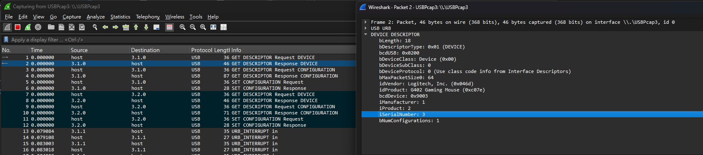
<p align="center">圖 1：第一次與 host 交互，可以看到基本的 USB 裝置資訊 VID/PID 等等的</p>

---

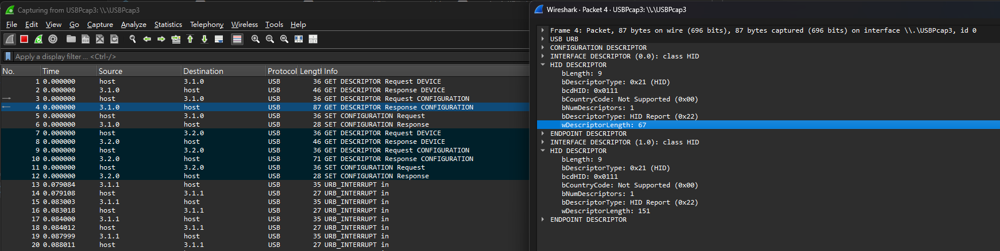
<p align="center">圖 2：第二次與 host 交互，可以看到有兩組 Descriptor</p>


結構上是:
* `Configuration Descriptor`
* `Interface Descriptor` -> `HID Descriptor` -> `Endpoint Descriptor`
* `Interface Descriptor` -> `HID Descriptor` -> `Endpoint Descriptor`

有兩組是因為現在很多滑鼠有提供額外的按鈕，所以會需要兩組 HID 來提供功能(複合型的滑鼠)，用 USBTreeViewer 可以更直觀

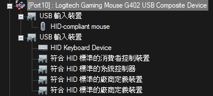

### 發現到的問題

觀察 (圖二) 封包的內容會發現兩個東西

```
USB URB
CONFIGURATION DESCRIPTOR
INTERFACE DESCRIPTOR (0.0): class HID
HID DESCRIPTOR
    bLength: 9
    bDescriptorType: 0x21 (HID)
    bcdHID: 0x0111
    bCountryCode: Not Supported (0x00)
    bNumDescriptors: 1
    bDescriptorType: HID Report (0x22)
    wDescriptorLength: 67 <---
ENDPOINT DESCRIPTOR
INTERFACE DESCRIPTOR (1.0): class HID
HID DESCRIPTOR
    bLength: 9
    bDescriptorType: 0x21 (HID)
    bcdHID: 0x0111
    bCountryCode: Not Supported (0x00)
    bNumDescriptors: 1
    bDescriptorType: HID Report (0x22)
    wDescriptorLength: 151 <---
ENDPOINT DESCRIPTOR
```

有某兩個東西是長度為 67 以及長度 151 的資料，但是 WireShark 後續也沒有看到任何相關的資料，只有滑鼠移動點擊與 host 交互的流程

那 USBTreeViewer 看到的呢?

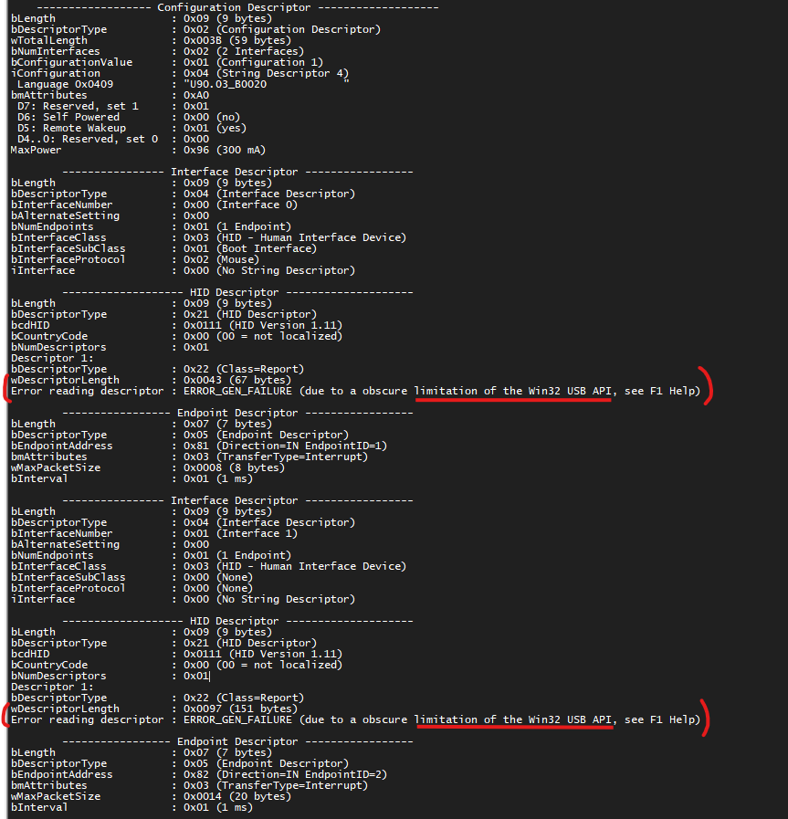

AI 給的解釋: 
```
這不是 USBTreeView 這個軟體的 Bug，而是 Windows 作業系統的安全機制與架構限制。

當你把滑鼠或鍵盤插入 Windows 電腦，並完成初始化 (Enumeration) 後，Windows 底層的系統驅動 (hidusb.sys) 會為了防範惡意軟體（例如 User-Space 的 Keylogger 或輸入竄改程式）而獨占 (Exclusive Lock) 這些高權限的 HID 設備。

USBTreeView 是一個運行在應用層 (User-Mode) 的普通軟體。當它試圖透過標準的 Win32 USB API，去向一隻「已經被 Windows 內核鎖死」的滑鼠要那 67 Bytes 和 151 Bytes 的 Report Descriptor 時，Windows 內核會直接拒絕這個請求，並拋出這個籠統的錯誤碼 ERROR_GEN_FAILURE。
```

解決方法: 在滑鼠插入 USB 孔前，WireShark 就要開好

### 再次擷取封包(先拔出滑鼠)

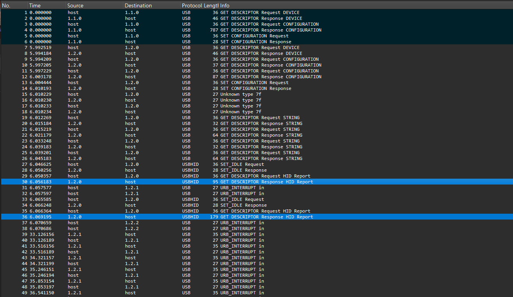
<p align="center">圖 3：這次可以看到給的資訊更多了，其中出現了兩個大一點的封包(Descriptor Response)。備註: 最上方的深藍色是 ignore 掉的其他裝置</p>

NO.15 ~ NO.36 是原本沒有出現的資料

* NO.15 ~ NO.18 `Unknow type 7f`: 

    ```
    AI: 這個 Unknow type 7f 其實是 Windows 系統特有的一個小動作，它的真實身分是 URB_FUNCTION_GET_MS_FEATURE_DESCRIPTOR。
    它在幹嘛： Windows 系統在滑鼠剛插上去時，會偷偷問滑鼠：「嘿，你有沒有支援微軟的專屬系統描述符 (OS Descriptors)？需不需要我幫你自動上網抓 WinUSB 驅動？」
    ```

* NO.19 ~ NO.26  `Descriptor Request/Response STRING`: 
    ```
    幾乎是一樣的封包，看 Response 是獲取了兩次 "Gaming Mouse G402" 字串
    ```

* NO.27 ~ NO.36  `Descriptor Request/Response HID Report`: 
    ```
    這裡就是重點了，USBTreeViewer 看不到的重要資料
    這裡的資訊將會成為後續改造開發版的重要資料來源
    ```


HID-compliant mouse:

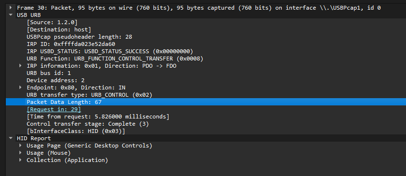

HID Keyboard Device + 符合 HID ...

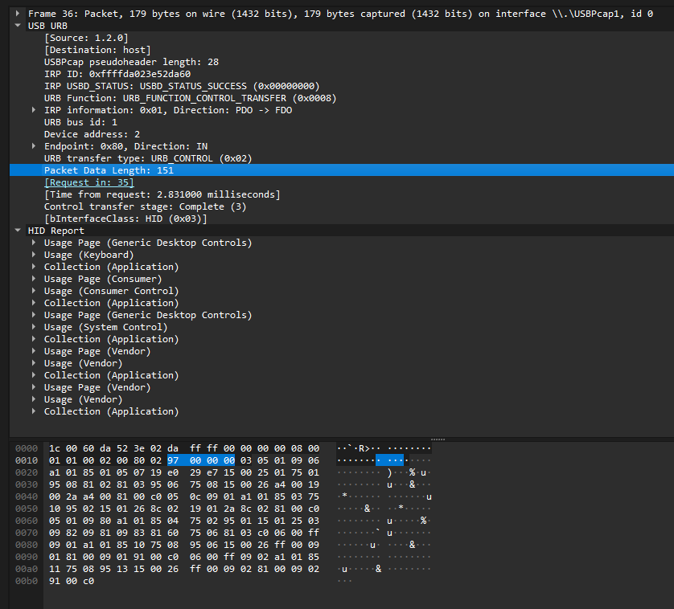

## 分析 HID 資訊與開發版的程式碼

### 編譯方式

原本編譯 CH32V307VCT6 的程式碼會需要 MRS(MounRiver Studio) 的開發工具
但我希望可以透過自己的 IDE (VSCode or Antigravity) 來開發

Makfile 可以讓 AI 輔助生成，需要讓 AI 理解 MRS(MounRiver Studio) 的環境，MRS 本身就會提供 make.exe，可以從他的專案挖出來用 **(因此還是會依賴 MRS)**

* Firmware: 
    * SRC: `https://github.com/openwch/ch32v307/tree/main/EVT/EXAM/SRC`
    * User: `https://github.com/openwch/ch32v307/tree/main/EVT/EXAM/User`
    * Makefile: 會要求 ToolChain 路徑
        * 例如: `make TOOLCHAIN_PATH="D:/MounRiver/MounRiver_Studio2/resources/app/resources/win32/components/WCH/Toolchain/RISC-V Embedded GCC/bin"`
* make: `D:\MounRiver\MounRiver_Studio2\resources\app\resources\win32\others\Build_Tools\Make\bin\make.exe`

1. 進到 `Firmware`
2. 執行 `D:\MounRiver\MounRiver_Studio2\resources\app\resources\win32\others\Build_Tools\Make\bin\make.exe TOOLCHAIN_PATH="D:/MounRiver/MounRiver_Studio2/resources/app/resources/win32/components/WCH/Toolchain/RISC-V Embedded GCC/bin" USER_DIR="CamoMouse"`
3. 執行成功後，會在 `Firmware/build` 生成很多檔案，其中最重要的就是 `CamoMouse-Forge.hex`
4. https://www.cnblogs.com/yangfengwu/p/16143635.html (這個網站有非常詳細的教學，有三種方式可以燒入 .hex 檔案)
    * 我是用 WCH-LinkE，需要 `D:\MounRiver\MounRiver_Studio2\resources\app\resources\win32\components\WCH\Others\SWDTool\default` 的 `WCH-LinkUtility.exe`

### 重點程式碼分析

* usbd_desc.c
    * HID 資料都在這裡做修改
    * WireShark 擷取的資料得放這裡
    * 其他程式碼也會引用到這裡的資料
    * USBTreeViewer & WireShark dump 出來的資訊放在 HID_info.md
    * 問題是其他資訊也會使用這邊的資料，那依賴於這個檔案的其他程式碼都要改嗎？
        * **長度動態計算 (不需改其他檔案)**：
            * `MyDevDescr`, `MyLangDescr`, `MyManuInfo`, `MyProdInfo`, `MySerNumInfo`, `MyQuaDesc`：被 `usbd_desc.h` 中的巨集讀取陣列第一位元組 `[0]` 自動取得長度。
            * `MyCfgDescr`：被 `usbd_desc.h` 中的巨集讀取陣列的 `[2]` 與 `[3]` 自動取得長度。
        * **寫死長度 (必須手動改 `usbd_desc.h`)**：
            * `KeyRepDesc` 的長度被寫死在 `#define DEF_USBD_REPORT_DESC_LEN_KB`。
            * `MouseRepDesc` 的長度被寫死在 `#define DEF_USBD_REPORT_DESC_LEN_MS`。
            * 如果修改了這兩個 Report 的長度，**務必**去 `usbd_desc.h` 同步更新這兩個巨集！
        * `MyQuaDesc` 在 USBTreeViewer 會看到:

            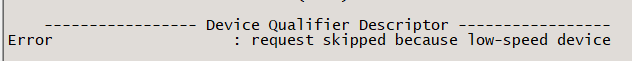
    * ch32v30x_usbfs_device.c 裡面就會使用中斷來獲取這些 desc

* usbd_composite_km.c
    * 滑鼠的行為，但我的開發版沒按鈕，也沒有光學滑鼠的裝置，但實際上只是根據其他腳位的狀態去設定 Data_Pack 傳給 host
    * 主要專注於怎麼發 MS_Data_Pack or KB_Data_Pack 給 host
    * 重點在於:
        * MS_Data_Pack 是 4 bytes，但是 G402 實際是 8 bytes 來控制

            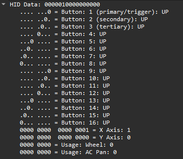

            紀錄於: `HID_info.md 的 Mouse Data Pack`
        * KM_Data_Pack 是 8 bytes，但是 G402 實際是 20 bytes 來控制

            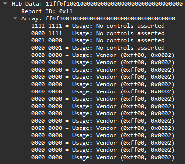
            
            紀錄於: `HID_info.md 的 Keyboard Data Pack`

        * 會發現 G402 和目前使用的封包有很大的差異
    * 可能會想說，開發版有自己的 HID pack data，和 G402 的 HID pack data，長度、格式，截然不同
      
      那電腦到底是怎麼知道要怎麼操作 ? 
      
      答案就是前面抓到的 HID Report Descriptor 就是操作說明書
    * 這個檔案會被 `g402_pack_builder` 取代掉，因為之後會用其他方式控制滑鼠，`g402_pack_builder` 目前的主要作用就是測試模擬滑鼠移動

* ch32v30x_usbfs_device.c
    * 處理函數中斷
    * 目前只有基本的理解，和處理掉一些不想用到的函數

## 嘗試修改 Descriptor 和使用 G402 的 HID Data

### 初次嘗試失敗 & 成功

這裡的進度
    * 只有改好 Descriptor
    * 把 `usbd_composite_km` 改成 `g402_back_builder`
    * 基本處理 `ch32v30x_usbfs_device.c` 的某些函數(依賴 `usbd_composite_km`)

錯誤分析:
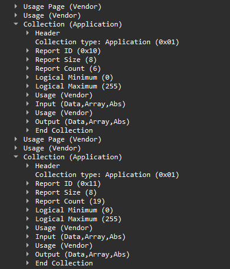

* usbd_desc.c 的基本設定錯誤
    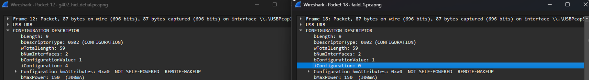

    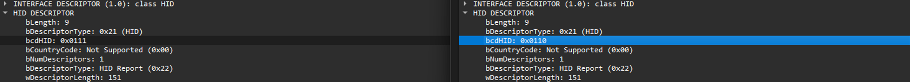

* KeyRepDesc & MouseRepDesc 搞反了，長度也沒對上
    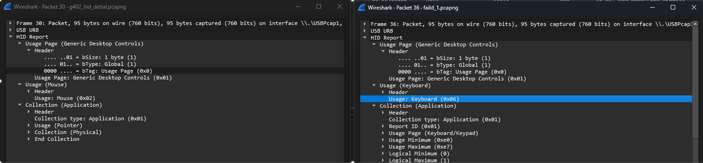

    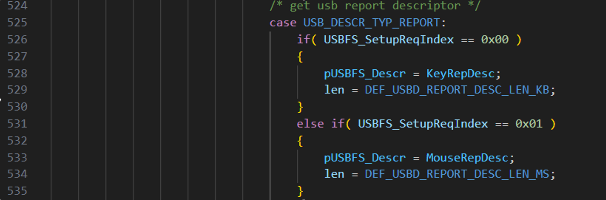

幸運的是這裡的錯誤改完後就可以成功讓滑鼠模仿 G402 的移動了!